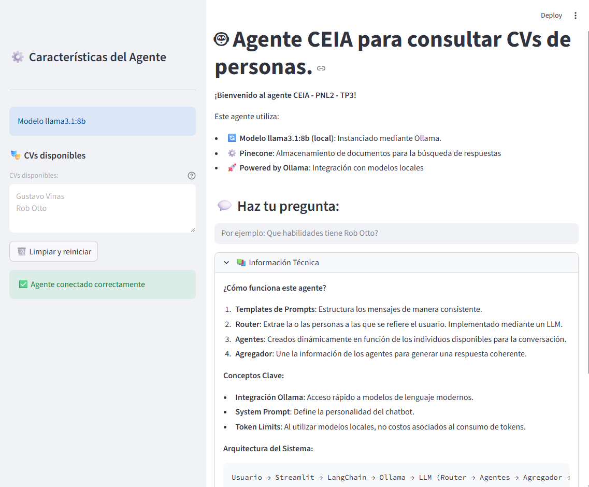
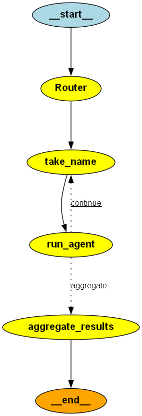

# CEIA_2025_B5_PNL2_TP3

Curso de Especialización en Inteligencia Artificial  
Año 2025  
Bimestre 5  

## Materia: Procesamiento del Lenguaje Natural 2  

## Docentes:
* Ezequiel Guinsburg
* Abraham Rodriguez

## Alumno:
* Viñas Gustavo

# TP3 - Agente RAG
Este proyecto tiene como objetivo implementar técnicas avanzadas en Retrieval-Augmented Generation (RAG) en el contexto del uso de agentes. El objetivo principal es la creación de un proyecto práctico, de principio a fin donde se implemente un agente que pueda contestar preguntas sobre distintos CVs de personas utilizando la librería LangChain  y la base de datos vectorial Pinecone , asegurando un enfoque de vanguardia para la gestión y recuperación de datos.

### Imagen del proyecto

 

## Tabla de contenido

1. [Diagrama](#diagrama)
2. [Etapas del agente](#etapas-del-agente)
3. [Preparación](#preparación)
    - [Pinecone](#pinecone)
    - [Ollama](#ollama)
    - [Langchain](#langchain)
4. [Población inicial](#población-inicial-de-bases-de-datos-vectoriales)
5. [Agente RAG](#agente-rag)
6. [Aplicación web](#aplicación-web)
7. [Despliegue](#despliegue)

## Diagrama

Diagrama básico de funcionamiento del agente:

 

## Etapas del agente

1. **Router**: Analiza la pregunta del usuario e identifica las personas mencionadas.
- **take_name**: Obtiene el nombre de la persona sobre la que se hace la pregunta y la quita del listado.
2. **Agentes**: Para cada persona mencionada, se ejecuta un agente específico que recupera y procesa la información relevante. Existirán tantos agentes como CVs de personas se hayan cargado en la base de datos vectorial. Cada agente utiliza un namespace distinto dentro del mismo índice de Pinecone, que representa a una persona.
- **condicion**:  Verifica si quedan personas en el listado.
3. **Agregador**: Combina las respuestas individuales en una respuesta final coherente y estructurada.


## Preparación
Antes de sumergirnos en la codificación del proyecto, es esencial configurar el ambiente con la cuenta de Pinecone.  
Además, es fundamental contar con Ollama local y un modelo descargado.

### Pinecone
Pinecone proporciona una solución de base de datos vectorial escalable, que permite almacenar y consultar datos vectoriales de alta dimensión de manera eficiente. Al crear una cuenta de Pinecone, puede configurar su base de datos vectorial, establecer parámetros de indexación e integrarla sin problemas en el flujo de trabajo de su proyecto.

Como mínimo se deben configurar las siguientes variables de entorno:  
`PINECONE_API_KEY`  

Para la carga inicial, adicionalmente se pueden configurar:  
`PINECONE_CLOUD` (default: 'aws')  
`PINECONE_REGION` (default: 'us-east-1')  
`PINECONE_INDEX_NAME` (default: 'ceia-2025-b5-pnl2-tp3')  
`PINECONE_RECREATE_INDEX` (default: False)  

Para el agente, adicionalmente se puede configurar:  
`PINECONE_INDEX_NAME` (default: 'ceia-2025-b5-pnl2-tp3')

### Ollama
El agente utiliza Ollama local para generar respuestas.  
Se debe contar con Ollama instalado (<a href="https://www.ollama.com/download" target="_blank">descargar Ollama</a>).  
Es necesario descargar el modelo que se desea utilizar (<a href="https://www.ollama.com/search" target="_blank">buscar modelos</a>).  
El comando para descargar el modelo es: `ollama pull <modelo>`  
Se debe configurar la variable de entorno:  
`MODEL_NAME` (default: 'llama3:8b')

### Langchain
LangChain proporciona una biblioteca completa de herramientas y recursos para implementar técnicas avanzadas de procesamiento del lenguaje.  
Para este proyecto, no es necesario obtener una cuenta de LangChain.

## Población inicial de Bases de Datos Vectoriales

Para poblar la Base de Datos de Pinecone, tienes que ejecutar este notebook: [carga_inicial.ipynb](carga_inicial.ipynb).  
Se procesarán y cargaran los documentos existentes en la carpeta definida por la variable de entorno `DOCS_DIR` (default: `./docs`).  
Por cada subdirectorio se creará un namespace distinto dentro del mismo índice de Pinecone, que representará a una persona.

## Agente RAG

El código en el archivo [agente.py](agente.py) implementa un agente que utiliza RAG (Retrieval-Augmented Generation) en la versión más reciente de LangChain.  
Este agente se encarga de responder preguntas sobre los CVs de las personas cargadas en la base de datos vectorial.  
La clase `Agent` contiene la implementación del agente.  
Si se ejecuta directamente (`python agente.py`), el agente responderá con casos de ejemplo incorporados.
Para utilizar el agente dentro de otra aplicación, se debe importar la clase `Agent` y crear una instancia de ella con los siguientes parámetros:

```python
people_names: List[str] - Lista de nombres de las personas cargadas en la base de datos vectorial.
default_person: str - Nombre de la persona por defecto que se utilizará si no se especifica una persona en la pregunta.
model: ChatOllama - Modelo de lenguaje utilizado para generar respuestas.
embedding_model: HuggingFaceEmbeddings - Modelo de embedding utilizado para la búsqueda en la base de datos vectorial.
index_name: str - Nombre del índice de Pinecone.
```

## Aplicación web

La aplicación de Streamlit se instancia en el archivo [front.py](front.py).  
El contenido es generado dinamicamente y esta embebido en el código fuente.

## Despliegue
Los requisitos para desplegar el proyecto se encuentran en el archivo [requirements.txt](requirements.txt).  
Se pueden instalar con el comando `pip install -r requirements.txt`.  
Adicionalmente el archivo [pyproject.toml](pyproject.toml) contiene la configuración del proyecto que permite instalar las dependencias con <a href="https://docs.astral.sh/uv/" target="_blank">uv</a> mediante el comando `uv sync`.

Para iniciar el chatbot ejecutar `streamlit run agente.py`.

## Demostración
<a href="https://youtu.be/msadd7KkFsQ" target="_blank">Video demostración</a>